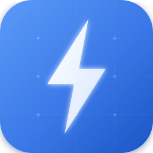
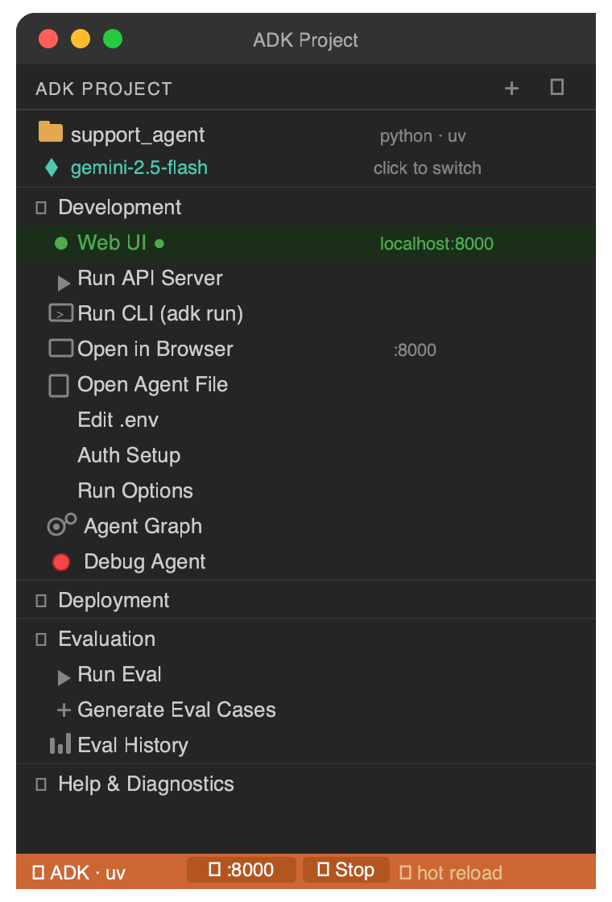
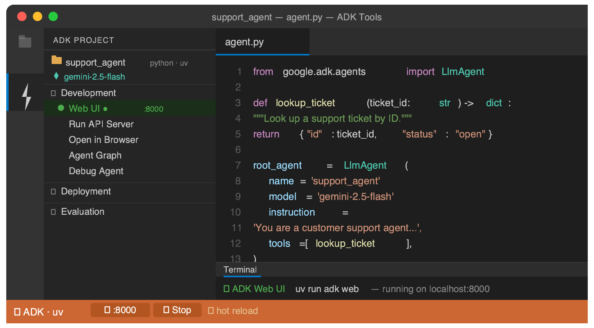
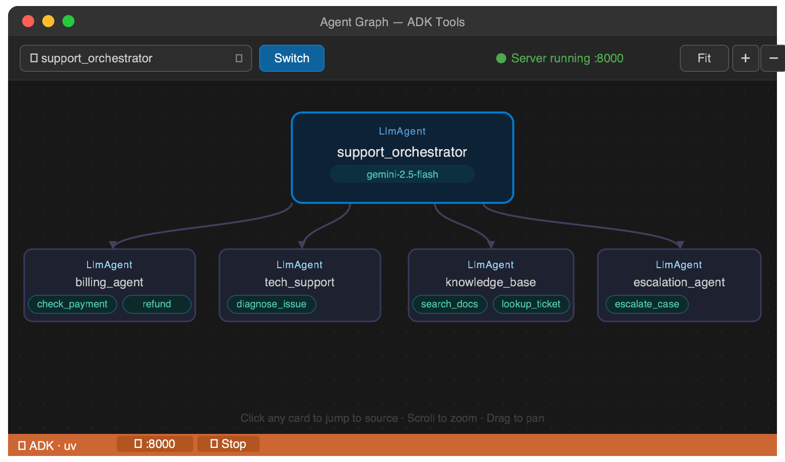

<div align="center">



# ADK Tools

**The VS Code extension for Google Agent Development Kit.**

Scaffold · Run · Debug · Visualize · Eval · Deploy — all from the editor.

[](https://marketplace.visualstudio.com/items?itemName=lenixbyte.adk-tools)
[](https://open-vsx.org/extension/lenixbyte/adk-tools)
[](https://open-vsx.org/extension/lenixbyte/adk-tools)
[](LICENSE)
[](https://code.visualstudio.com/)

</div>

---

<div align="center">
<table border="0" cellspacing="0" cellpadding="10">
<tr>
<td align="center" valign="top">
<br/>
<sub><b>Sidebar</b> — every feature one click away</sub>
</td>
<td align="center" valign="top">
<br/>
<sub><b>Editor</b> — live server, hot reload, status bar</sub>
</td>
</tr>
<tr>
<td colspan="2" align="center"><br/>
<br/>
<sub><b>Agent Graph</b> — interactive hierarchy with click-to-source navigation</sub>
</td>
</tr>
</table>
</div>

---

## Features

### Server Management
Start `adk web` or `adk api_server` directly from the sidebar or status bar. Automatic environment detection (uv · pipenv · .venv · system), port conflict handling, hot reload toggle, and a live status bar that resets when the server exits.

### Agent Graph
Visualize your entire agent hierarchy as an interactive graph — live from the running server via `/dev/{app}/graph`, with disk-parse fallback when offline. Pan, zoom, and click any card to jump to the source file. Works with multi-agent repos — pick the agent from a list.

### Debug Agent
One click generates `.vscode/launch.json` with a debugpy configuration pointed at the ADK binary. Set breakpoints anywhere in your agent code and hit F5.

### Model Switcher
Fetches available models live from Vertex AI or Google AI using your credentials, shows the current model highlighted, rewrites `model=` in your agent file in-place, and offers to restart the server.

### Eval Case Generation
4-step wizard: eval set name → case count → generation instruction → environment context. Calls `adk eval_set generate_eval_cases`, streams output live. Auto-installs `google-cloud-aiplatform[evaluation]` if missing.

### Eval History
Tracks every eval run in `.adk/eval_history.json`. Open the Eval History panel to see pass rates, case counts, and model used across runs.

### Project Scaffolding
Guided wizard: pick agent type (Single Agent · Multi-Agent Pipeline · MCP Agent · A2A Agent), set up auth, choose model. Generates the full file structure, `__init__.py`, `.env`, and `.gitignore` — no terminal needed.

### @adk Chat Participant
Type `@adk` in GitHub Copilot Chat, Cursor, or Windsurf. Gets context from your project — agent file, model, auth, eval history — and answers ADK questions with project-aware responses.

### Code Snippets
17 Python snippets and 11 TypeScript snippets. Type `adk-` and press Tab.

### Auth Setup
Gemini API key → writes to `.env`, checks `.gitignore`. Vertex AI → runs `gcloud auth application-default login`, sets project and region.

### Deployment
Guided wizards for Cloud Run, Vertex AI Agent Engine, and GKE.

---

## Installation

**VS Code Marketplace** — search `ADK Tools` in the Extensions panel, or:
```
ext install lenixbyte.adk-tools
```

**Open VSX** (Cursor, Windsurf, Gitpod) — same ID:
```
ext install lenixbyte.adk-tools
```

**Manual** — download `.vsix` from [Releases](https://github.com/lenixbyte/adk-tools/releases) → drag into the Extensions panel

**Requirements:** VS Code 1.85+ · [google-adk](https://adk.dev/get-started/installation/) (`pip install google-adk`)

---

## Quick Start

1. **Open your ADK project** — any folder with `agent.py` / `agent.ts` and an ADK import is detected automatically.
2. **Click ▶ Run Web UI** in the sidebar — the server starts and a browser prompt appears.
3. **Explore** — switch models, open the agent graph, set breakpoints, run evals — all without leaving the editor.

> First time? Use **ADK: Create New Agent Project** to scaffold a complete project from scratch.

---

## Sidebar Layout

```
ADK PROJECT
├── support_agent   python · uv
│   └── gemini-2.5-flash          ← click to switch model
│
├── Development
│   ├── ▶  Run Web UI
│   ├── ⊙  Run API Server
│   ├── ▷  Run CLI (adk run)
│   ├── 🔗 Open in Browser
│   ├── 📄 Open Agent File
│   ├── 🔑 Edit .env
│   ├── 🛡  Auth Setup
│   ├── ⚙  Run Options
│   ├── 🕸  Agent Graph
│   └── 🐛 Debug Agent
│
├── Deployment
│   ├── ☁  Deploy to Cloud Run
│   ├── ⬡  Deploy to Agent Engine
│   └── ⎔  Deploy to GKE
│
├── Evaluation
│   ├── ▷  Run Eval
│   ├── +  Generate Eval Cases
│   └── 📊 Eval History
│
└── Help & Diagnostics
    ├── Getting Started
    ├── Run Diagnostics
    ├── Kill Port 8000
    ├── Show Output Log
    └── Open ADK Docs
```

---

## Status Bar

| State | Display |
|---|---|
| Idle | `⚡ ADK · uv` &ensp; `▶ Web` &ensp; `⊙ API` |
| Web running | `⚡ ADK · uv` &ensp; `📡 :8000` &ensp; `◼ Stop` |
| API running | `⚡ ADK · uv` &ensp; `⊙ :8000` &ensp; `◼ Stop` |

Polls the port every 4 seconds. Status resets automatically when the server exits.

---

## Environment Detection

| Environment | Detected by | Command |
|---|---|---|
| uv | `uv.lock` or `[tool.uv]` in pyproject.toml | `uv run adk ...` |
| Pipenv | `Pipfile` present | `pipenv run adk ...` |
| .venv | `.venv/bin/adk` exists | `.venv/bin/adk ...` |
| System | fallback | `adk ...` |

---

## Code Snippets

Type `adk-` in a `.py` or `.ts` file and press **Tab**.

<details>
<summary><strong>Python — 17 snippets</strong></summary>

| Prefix | Inserts |
|---|---|
| `adk-agent` | `LlmAgent(...)` |
| `adk-root` | `root_agent = LlmAgent(...)` |
| `adk-agent-file` | Complete `agent.py` with one tool |
| `adk-init` | `__init__.py` exporting `root_agent` |
| `adk-tool` | Tool function with docstring |
| `adk-google-search` | Agent with built-in Google Search |
| `adk-agent-tool` | `AgentTool(agent=...)` |
| `adk-mcp` | `MCPToolset` with `StdioServerParameters` |
| `adk-sequential` | `SequentialAgent(...)` |
| `adk-parallel` | `ParallelAgent(...)` |
| `adk-loop` | `LoopAgent(...)` |
| `adk-state` | Session / user / app-scoped state |
| `adk-before-model` | `before_model_callback` |
| `adk-after-model` | `after_model_callback` |
| `adk-before-tool` | `before_tool_callback` |
| `adk-after-tool` | `after_tool_callback` |
| `adk-env` | `.env` template |

</details>

<details>
<summary><strong>TypeScript — 11 snippets</strong></summary>

| Prefix | Inserts |
|---|---|
| `adk-agent` | `new LlmAgent({...})` |
| `adk-root` | `export const rootAgent = ...` |
| `adk-agent-file` | Complete `agent.ts` with one FunctionTool |
| `adk-tool` | `new FunctionTool({...})` |
| `adk-sequential` | `new SequentialAgent({...})` |
| `adk-parallel` | `new ParallelAgent({...})` |
| `adk-loop` | `new LoopAgent({...})` |
| `adk-state` | Session / user / app-scoped state |
| `adk-before-model` | `beforeModelCallback` |
| `adk-after-model` | `afterModelCallback` |
| `adk-before-tool` | `beforeToolCallback` |

</details>

---

## Commands

**Development**

| Command | Description |
|---|---|
| `ADK: Run Web UI` | Start `adk web` |
| `ADK: Run API Server` | Start `adk api_server` |
| `ADK: Stop All Servers` | Stop running servers |
| `ADK: Open ADK Web UI in Browser` | Open localhost in browser |
| `ADK: Run CLI (adk run)` | Interactive CLI with agent and session picker |
| `ADK: Switch Model` | Change model — live fetch from Vertex AI / Google AI |
| `ADK: Run Options` | Port · hot reload · log level · session storage |
| `ADK: Agent Graph` | Visualize agent hierarchy (live + offline) |
| `ADK: Debug Agent` | Generate `launch.json` for debugpy |
| `ADK: Open Agent File` | Jump to `agent.py` / `agent.ts` |
| `ADK: Edit .env File` | Open or create `.env` |
| `ADK: Show .env Summary` | Preview env vars with masked secrets |
| `ADK: Auth Setup` | Gemini API key or Vertex AI credentials |

**Deployment**

| Command | Description |
|---|---|
| `ADK: Deploy Agent` | Cloud Run / Agent Engine / GKE wizard |
| `ADK: Create New Agent Project` | Scaffold with agent type picker |

**Evaluation**

| Command | Description |
|---|---|
| `ADK: Run Eval` | Run `adk eval` on an eval set |
| `ADK: Generate Eval Cases` | Generate synthetic eval cases |
| `ADK: Eval History` | View pass rates across eval runs |

**Diagnostics**

| Command | Description |
|---|---|
| `ADK: Run Diagnostics` | Check tools, port, environment |
| `ADK: Kill Port 8000` | Force-free stuck port |
| `ADK: Show Output Log` | Open ADK Tools output panel |
| `ADK: Getting Started` | Getting started panel |
| `ADK: Open ADK Documentation` | Open adk.dev |

---

## Project Detection

Recognized (in order):
1. `.adk/` directory at workspace root
2. `agent.py` / `agent.ts` with ADK imports within 3 directory levels
3. `requirements.txt` or `pyproject.toml` containing `google-adk`

Multi-agent repos are supported. The agent picker appears wherever agent selection is needed.

---

## Contributing

Issues and PRs welcome at [github.com/lenixbyte/adk-tools](https://github.com/lenixbyte/adk-tools).

---

## License

Apache 2.0 — see [LICENSE](LICENSE)

<div align="center">
<sub>Built for the <a href="https://adk.dev/">Google ADK</a> community</sub>
</div>
